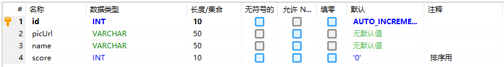

# 实现

## 配置

使用Redis前，需要对RedisTemplate对象进行设置，否则会出现乱码。

```java
@Configuration
@EnableCaching
public class RedisConfig extends CachingConfigurerSupport {
    @Bean
    @Primary // 这个注解非常重要，不然会出现两个redisTemplate
    public RedisTemplate<String, String> redisTemplate(RedisConnectionFactory factory) {
        RedisTemplate template = new RedisTemplate();
        template.setConnectionFactory(factory);
        // 设置key序列化类，否则key前面会多乱码
        RedisSerializer keySerializer = new StringRedisSerializer();
        template.setKeySerializer(keySerializer);
        template.setHashKeySerializer(keySerializer);
        // 设置内容序列化
        GenericJackson2JsonRedisSerializer jsonSerializer = new GenericJackson2JsonRedisSerializer();
        template.setValueSerializer(jsonSerializer);

        template.afterPropertiesSet();
        return template;
    }
}
```

由于使用Redis数据库作为缓存，有些操作逻辑会比较复杂但互不影响，可以考虑用多线程解决。

```java
@Configuration
@EnableAsync
public class AsyncConfig implements AsyncConfigurer {
    @Bean
    public Executor getExecutor() {
        ThreadPoolTaskExecutor executor = new ThreadPoolTaskExecutor();
        executor.setCorePoolSize(10); // 核心线程数：线程池创建时初始化的线程数
        executor.setMaxPoolSize(20); // 最大线程数：线程池最大的线程数，只有在缓冲队列满了之后才会申请超过核心线程数的线程
        executor.setQueueCapacity(500); // 缓冲队列：用来缓冲执行任务的队列
        executor.setKeepAliveSeconds(60); // 允许线程的空闲时间，单位秒，超过了核心线程之外的线程在空闲时间到达之后会被销毁
        executor.setThreadNamePrefix("async-service-"); // 线程名称的前缀，设置好后可以方便定位处理任务所在的线程池
        executor.setRejectedExecutionHandler(new ThreadPoolExecutor.DiscardPolicy()); // 缓冲队列满了之后的拒绝策略：由调用线程处理（一般是主程序）
        executor.initialize();
        return executor;
    }
}
```


## 返回类

为了统一返回值，定义了一个RespBody作为统一的返回值。

```java
@Data
public class RespBody implements Serializable {
    private Integer status; // 大于0成功，等于0失败，小于0有错
    private Object data;

    public RespBody(Integer status, Object data) { // 设为public是为了应对以后的其他情况
        this.status = status;
        this.data = data;
    }

    public static RespBody ok(Object data) {
        return new RespBody(1, data);
    }

    public static RespBody failed(Object data) {return new RespBody(0, data);}

    public static RespBody error(Object data) {
        return new RespBody(-1, data);
    }

    public static RespBody build(Integer status, Object data) {
        return new RespBody(status, data);
    }
}
```


## 错误处理

在运行时难免会产生错误，这是就需要对错误进行处理。基于真实情况，将错误信息分为两种：前端（即用户）可以看到的，后端日志输出的。前者只需要一个提示就行，而后者希望提示信息能够具体些，便于今后的修改。因此，使用了HikersException作为系统运行问题的基类，ExceptionHandler作为处理这些问题的类。他们的定义如下：

HikersException，字段message是返回给用户的信息，字段info是输出到日志的信息。

```java
public class HikersException extends RuntimeException{
    private String message;
    private String info;

    public HikersException(String message, String info) {
        super();
        this.message = message;
        this.info = info;
    }

    @Override
    public String getMessage() {
        return message;
    }

    public String getInfo() {
        return info;
    }
}
```

ExceptionHandler，将info输出到日志，将message输出到前端。

```java
@ControllerAdvice
@Slf4j
public class ExceptionHandle {
    @ExceptionHandler(HikersException.class)
    @ResponseBody
    public RespBody handle(HikersException e) {
        log.error(e.getInfo());
        return RespBody.error(e.getMessage());
    }
}
```


## 论坛分区管理

首先分析需求。对于用户来说，获取分区是比较常用的操作；而对于管理员来说，分区不经常修改。而且对于一个论坛，分区并不会很多，因此在项目启动时，可以将分区数据全部存入Redis中，不需要复杂的数据结构，当作JSON处理就行，当需要修改时，先在MySQL数据库中进行修改，再在Redis中进行同步即可。

MySQL中用parts表进行保存，定义如下图所示。

